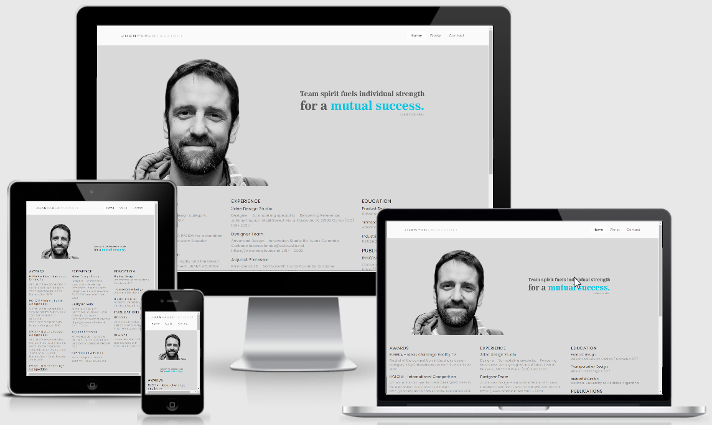
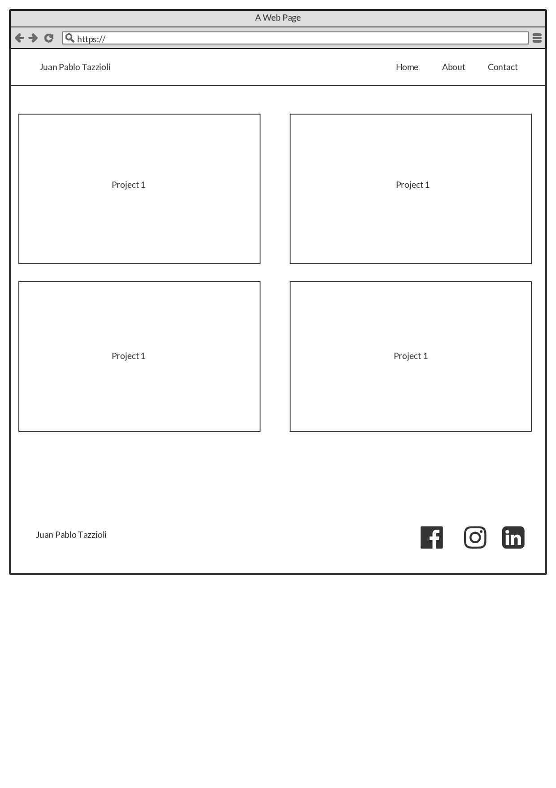
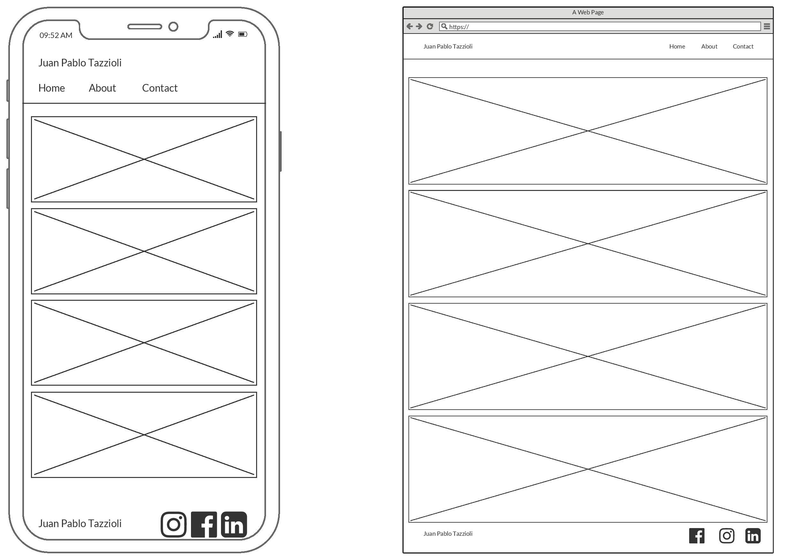
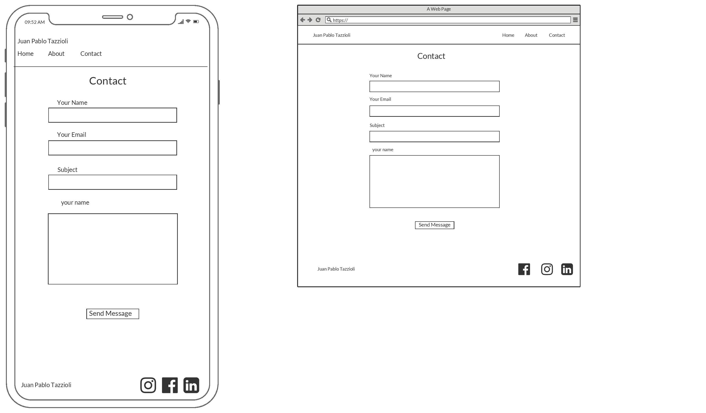

# Juan Pablo Tazzioli  Portfolio 

<h2 align="center"></h2>

Live Demo [here]( https://federvgh.github.io/MS1-Portfolio/index.html).

## Table of Contents
> - [Overview](#overview)
> - [UX](#ux)
> - [User Stories](#user-stories)
> - [Features](#features)
> - [Technologies Used](#technologies-used)
> - [Testing](#testing)
> - [Deployment](#deployment)
> - [Bugs and Solutions](#Bugs-and-Solutions)
> - [Credits](#credits)

## Overview

The idea of this project was to create a website of an industrial Designer based in Milan. The site shows the 
designer's portfolio along with information about him, and a contact form. 

## UX

-   ### User stories

    -   #### First Time Visitor

        1. As a First Time Visitor, I want to understand this is a portfolio of an industrial designer.        
    	2. I want to easily navigate through the website and find information about the designer and showcase of his work.

	-   #### Returning Visitor
	     As a returning visitor, I would like to find a way of contacting him. 
	     As a returning visitor, I would like to follow him on social networks.

    -   ### Design
    -   The Design was minimalistic, with small letters and grey colors, this was done with the idea of 
            making the images stand out from the background.
   
    -   #### Typography
        -   The Poppins font is the main font used throughout the whole website with Sans Serif as the 
        fallback font in the case for any reason the font isn't being imported into the site correctly.

    -   #### Imagery
        -   All images were created and provided by Juan Pablo Tazzioli, in some cases we used 
        large images that had inscriptions on them explaining each project, in other cases the images are self-explained.

#### Wireframes

Home Page 
 
Works  Page 
 
Project Page 
 
Contact Page 
 

#### Modifications to original Design
In the original design, what is now the “Home” section was the “About” section and  
what is now the “works” section was the “home” section, but after evaluating some user
experiences I realize the purpose of the website was not clear so I decided to change it. 
I did not change the Mockups because I consider them part of the original design, and I 
think every design changes according to needs. The social media links will not take you
to the designer's social media site because they are not ready yet, as soon as I am provided
with the links, i will update it, for now, it will only take you to the main page of Facebook,
Linkedin and Instagram. 

## Features

-   Responsive on all device sizes

## Technologies Used

### Languages Used

-   [HTML5](https://en.wikipedia.org/wiki/HTML5)
-   [CSS3](https://en.wikipedia.org/wiki/Cascading_Style_Sheets)

### Frameworks, Libraries & Programs Used

1. Bootstrap
- Bootstrap was used for the grid system and to help with the responsiveness for all devices. 
2. Fontawesome
- Fontawesome was used for the social media icons 
3. Google Fonts
- Google Font was used to import the Poppins font through the entire website
4. Github
- Github was used to store the code pushed through Gitpod
5. Gitpod
- Gitpod was the  Integrated Development Environment used to develop the Website.
6. Balsamiq
- Balsamiq was used to create the wireframes during the design process.
7. Picresize
- Picresize was used to reduce and resize images.
8. Chrome DevOps Tools	
- Chrome DevOps Tools was used to check elements and help debug issues with the site layout and try different CSS styles.

## Testing

I used W3C HTML Validator and W3C CSS Validator Services to ensure there were no syntax errors in the project.

-   [W3C HTML Validation](https://validator.w3.org/) 
-   [W3C CSS Validator](https://jigsaw.w3.org/css-validator/#validate_by_input) 

All links to external websites open in a new browser.

Form validation is required to ensure the correct
inputs are taken and that all fields are required.

### Testing User Stories from User Experience (UX) Section

-   #### First Time Visitor Goals

1.	As a First Time Visitor, I want to easily understand the main purpose of the site.

2. Upon entering the site, users can see a photo of the designer along with a phrase that represents his work philosophy. Below the photo, you can find details about the designer like work experience, education, and awards that make it clear he is an industrial designer.

3. On the bottom there is an image with logos of the software the designer has experience using, the logo is easily recognized by fellow designers.

4. As a First Time Visitor, I want to easily be able to navigate throughout the site to find content.

5. The landing site has been designed to be simple and give an introduction of the designer. At the top of the page, there is a navigation bar, each link describes where it will lead you.

6. Once you go to the work section you can find the different projects, if you hover over the projects you can see a description with the title highlighted making it easy to click, which will take you to the site of that specific project, and you will be able to see more images and get more information about it.

7. The user can also scroll to the bottom of any page on the site to locate social media links in the footer.

8. Contact form won't allow you to send a message if all the fields are not properly filled.

### Further Testing

-   The Website was tested on Google Chrome, Internet Explorer, Microsoft Edge, Opera, and Safari browsers.
-   The website was viewed on different devices such as Desktop, Laptops, Android phones, iPhone 6, and iPhone x, and I used http://www.responsinator.com/ as well to check responsiveness.
-   I asked friends and family members to review the site and give me feedback about the user experience.

## Deployment

The project was deployed to GitHub with the following steps:

1. Log in to GitHub and locate the [GitHub Repository](https://github.com/)
2. Select “your profile” from the upper-right dropdown menu and select the proper repository.
3. Select Settings and Scroll down until you locate the "GitHub Pages" Section.
4. Under "Source", click the dropdown called "None" and select "Master Branch".
5. The page will automatically refresh.
6. Scroll back down through the page to locate the now published site [link](https://federvgh.github.io/MS1-Portfolio/index.html) in the "GitHub Pages" section.

## Bugs and Solutions

1. I had issues with images on small and large devices, I addressed this issue using @media on my CSS, targeting the images and text 
that did not adapt properly.
2. Some images took to long to load so i had to reduce the size of the file
3. I had issues centering the images, I used bootstrap d-flex justify-content-center to accomplish this.

## Credits

-   The Contact form was copied from Stefan Rusu – codepen
-   The hover effect on the images was taken from https://www.w3schools.com
-   I took inspiration and ideas from these websites https://kingstudio.ro/demos/mnml/index6.html and https://www.marioferrarini.com/  
-   All content in the "works"  "Home" and “Project” sections were written by me.
-   All images were created and provided by Juan Pablo Tazzioli.
-   My Mentor for helping me when I was stuck.  
-   The slack community for its extensive Q&A, I found most of the answers to my problems there.  
